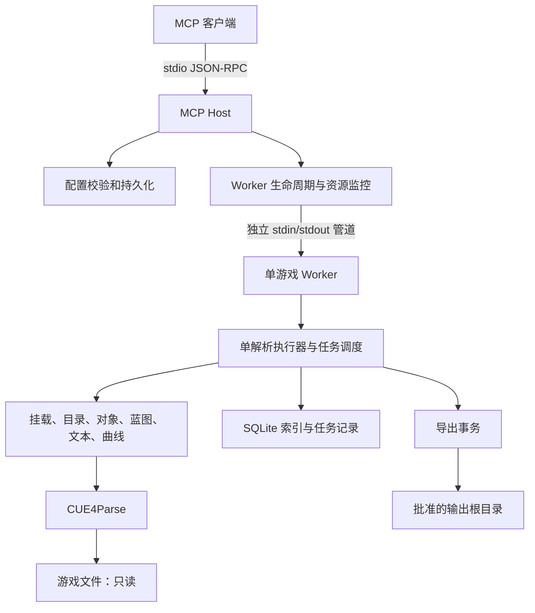
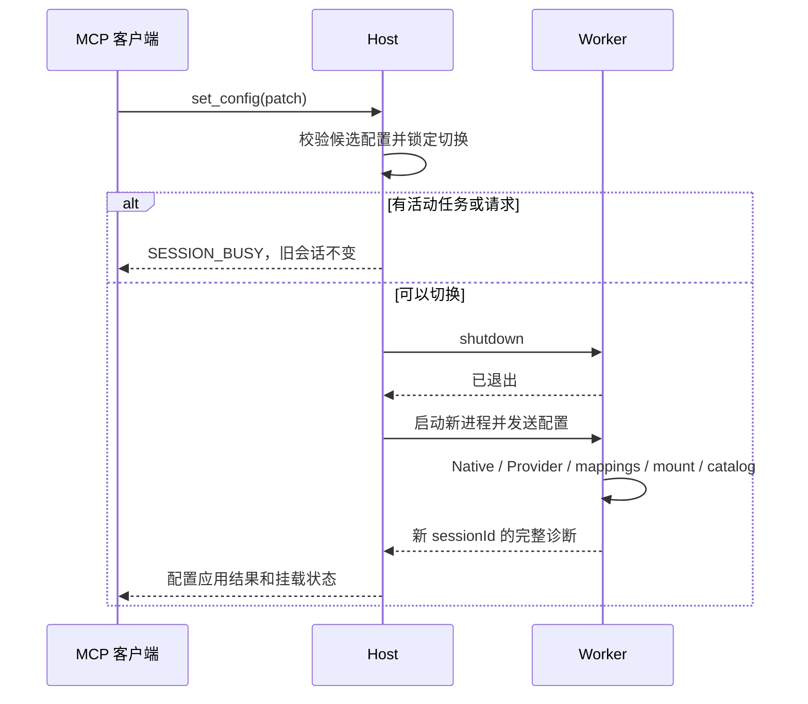

# FModel MCP：面向黑神话逻辑 MOD 的架构设计

> 交付类型：开发交接设计，不是已实现系统的说明。目标读者是接手开发的模型及个人维护者。
> 核实日期：2026-09-05。用户已确认产品范围；本文给出推荐的 v1 工程契约。源码事实、设计规定、待验证项分别标识。
> 阅读结果：开发者无需重放聊天，即可确定要做什么、如何分层、哪些输出可信，以及怎样验收。

## 1. 阅读与权威边界

按下面顺序阅读；四份文件合起来是一份架构设计，各自只维护一种事实：

1. **本文**：产品边界、运行架构、配置、生命周期、安全与资源预算。
2. [工具契约](tool-contracts.md)：所有 MCP 工具的输入、输出、分页、错误和示例。
3. [解析与索引设计](parser-and-indexes.md)：CUE4Parse 适配、数据模型、SQLite、检索算法、上游补丁。
4. [实施与验收](development-plan.md)：依赖固定、开发顺序、真实样本、自动化测试、交付门禁及证据来源。

接手者先完成实施文档的 P0，再编写 MCP 业务工具。发现底层与本设计矛盾时，用复现证据修改受影响的唯一章节；不得靠空数组、猜测默认值或静默回退把验收“做绿”。

本文的计划目录、接口名称和命令是**将来实现的要求**，目前仓库没有可运行项目。CUE4Parse 的事实以实施文档记录的本地源码快照为基线，不能声称它对应某个尚未查明的 Git 提交。

## 2. 已确认需求与非目标

### 2.1 用户已确认

- 主要辅助**逻辑 MOD**：定位业务资源、读取数值和字段、理解蓝图类与函数、追踪依赖、导出给后续工具。
- 本机 Windows x64 使用，MCP 采用 stdio；没有远程 HTTP、鉴权服务、多租户需求。
- 一个 MCP 实例同一时刻只加载一款游戏。多份配置用不同文件保存，启动时选一份。
- 游戏配置必须包含：游戏根目录、引擎版本/游戏预设、AES Key、usmap。
- 导出只做原始包及 JSON，不做模型、材质、动画、音频转换。
- 黑神话悟空是验收对象。不为通用游戏兼容性建立插件市场、适配器注册框架。
- 接受 .NET 10，并固定 CUE4Parse 依赖。当前任务只交付设计，不实施业务代码。

### 2.2 v1 必须具备

- 配置修正与重挂载、可解释的状态和容器列表。
- 文件/目录定位、资源类型和类/函数/属性符号索引。
- 对象、DataTable、StringTable/locres、曲线、蓝图元数据读取。
- 蓝图函数的参数/标志及**带完整性声明的 Kismet 表达式**读取。
- 中文文本检索，保留“文本 → 本地化键 → 表格行/字段”的证据。
- 包级 import 依赖图；明确它不是完整的对象引用图或运行时调用图。
- 原始包/伴随文件和完整 JSON 导出。
- 长扫描任务、取消、覆盖率、失败清单、缓存失效与稳定分页。

### 2.3 明确不做

- 注入游戏进程、运行 UE4SS、执行 Lua/C++、注册 Hook、读写游戏内存。
- 修改游戏包、自动打包/安装 MOD、修改游戏根目录任何文件。
- 还原编辑器蓝图节点、恢复原始 C++、保证静态函数名就是可 Hook 的运行时路径。
- 自动猜 AES、自动取得 usmap、自动联网修复解析依赖。
- 首版 IoStore 支持或把 IoStore 数据转换成传统 uasset。发现 utoc/ucas 时进入明确诊断，不计作已支持挂载。
- UE4SS API 生成、反编译伪代码、对象级软引用扫描、游戏业务 ID 推理属于后续扩展，不挤进 v1 验收。

**MOD 边界**：本程序是离线研究工具。输出资产的静态事实与证据，开发者自行在游戏运行时验证 Hook、对象实例和业务效果。

## 3. 术语与责任归属

这些是本设计内部的唯一表达；没有额外业务服务或网络边界。

| 术语 | 含义与边界 | 所有模块 |
|---|---|---|
| 游戏配置 | 一份待应用的本地配置，不等于已成功挂载 | Host / ConfigService |
| 会话 Session | 一个 Worker 进程及其唯一配置、Provider、目录快照 | Host / WorkerSupervisor |
| 容器 Archive | 一个 pak；密钥 GUID 不作为容器唯一 ID | Worker / MountService |
| 物理条目 Entry | 某容器中某个路径的一份文件，可被其他容器覆盖 | Worker / CatalogService |
| 有效文件 EffectiveFile | 按实际 ReadOrder 选出的唯一文件；平级冲突不猜赢家 | Worker / CatalogService |
| 包 Package | `.uasset` 或 `.umap` 及其实际存在的伴随文件 | Worker / PackageReader |
| 对象 Object | 包内 export，有 Outer 链；不等于包，也不等于运行时实例 | Worker / PackageReader |
| 符号 Symbol | 类、函数或属性的已观察元数据 | Worker / BlueprintReader |
| 索引快照 Snapshot | 某类索引对一个声明范围的一次构建结果 | Worker / IndexStore |
| 覆盖率 Coverage | 扫过哪些有效包、哪些失败、哪些未知，不代表完整游戏语义 | Worker / IndexStore |
| 业务 ID | 游戏表格字段或行名；本地化 key 不是天然的业务 ID | 结果消费者解释，MCP 只报告来源 |

## 4. 技术与进程架构

### 4.1 技术选择

- C# / .NET 10、Windows x64。
- 官方 `ModelContextProtocol` SDK，stdio transport；`Microsoft.Extensions.Hosting` 管理宿主。
- CUE4Parse 源码依赖；Newtonsoft.Json 用于 UE 内容序列化。
- System.Text.Json 用于 MCP 外层 DTO 和内部 IPC，不把 UObject 交给它做反射序列化。
- Microsoft.Data.Sqlite，启用外键、WAL、FTS5 trigram。P0 验证实际打包的 SQLite 是否支持 trigram。
- 单可执行程序、两种启动模式：默认 MCP Host；`--worker` 是内部模式。
- 不依赖 FModel 可执行文件、WPF、CUE4Parse-Conversion。参考 FModel 思路，不直接搬运 GPL 代码。

包版本不得使用浮动范围。具体 NuGet 版本、SDK patch 和上游提交由 P0 解析、验证后写入锁文件；本文没有伪造尚未验证的版本号。

### 4.2 为什么需要独立 Worker

**源码事实**：`UStringTable.TryGet` 使用按 tableId 缓存的进程级字典，没有按 Provider 隔离。`Globals`、Oodle 和部分解析辅助对象也有进程级状态。仅 Dispose Provider 不足以证明重挂载干净。

**设计决定**：更换解析配置就停止旧 Worker，再创建新 Worker。任何时刻最多一个解析 Worker。这样不用侵入多个上游缓存，且可以隔离原生解压崩溃、失控内存和无法及时取消的同步解析。

这不是微服务：Host 和 Worker 是同一个程序的两个进程，通过匿名管道通信，无监听端口、无远程部署。



### 4.3 模块职责

| 模块 | 负责 | 不负责 |
|---|---|---|
| McpTools / ResultMapper | 工具 schema、参数校验、MCP isError、输出预算 | 引用 CUE4Parse 类型或写 SQL |
| ConfigService | JSON 读写、配置补丁、路径和敏感值校验 | 声称 AES 或 usmap 与游戏匹配 |
| WorkerSupervisor | 启停、IPC、超时/内存、会话版本、失联诊断 | 自动重试解析、隐式切换旧会话 |
| WorkerDispatcher | 消息收发、取消路由、任务状态快照 | 并发调用 Provider |
| ParseScheduler | 一次一个解析操作；任务逐包让出执行权 | 假装同步 CUE4Parse 可以立即取消 |
| MountService / CatalogService | 容器、覆盖规则、有效文件、目录、路径映射 | 用包数量代替文件去重 |
| PackageReader / 专用 Reader | CUE4Parse → 有来源和完整性的 DTO | 在 Host 传递 UObject 或 Lazy |
| IndexStore / IndexBuilders | SQLite 快照、类型/符号/文本/包依赖 | 永久保存 Provider 对象 |
| ExportService | 安全路径、临时写入、清单、原子提交 | 写入游戏目录或自动安装 MOD |

### 4.4 建议源码布局

以下是实施后的目标，不要求现在创建空目录或占位类。

```text
src/FModelMcp/
  Program.cs                  # Host / Worker 模式分流
  Host/                       # MCP、配置、Supervisor、结果映射
  Contracts/                  # DTO、错误码、内部 IPC，不引用 UObject
  Worker/                     # Dispatcher、Scheduler、Mount、Catalog
  Parsing/                    # Package、Blueprint、Table、Text、Curve、投影
  Indexing/                   # SQLite schema、查询和三个构建器
  Exporting/                  # 输出路径和导出事务
  FModelMcp.csproj
third_party/CUE4Parse/         # P0 选择的固定源码，含可追踪的小补丁
config/blackmyth.example.json  # 无真实 AES 的配置示例
patches/                      # 仅当采用补丁文件方式管理上游差异时创建
tests/FModelMcp.Tests/         # 单元、协议与真实样本集成测试
```

一个产品项目、一个测试项目足够。不要为每个 Reader 新建程序集。只有存在测试替身或真实多实现的边界才抽接口，例如 Worker 进程、文件系统、CUE 包读取入口。

## 5. 配置契约

### 5.1 配置示例

下面是未来 `blackmyth.local.json` 的形状。占位 AES 必须替换为用户已提供的真实值；本设计不把真实密钥复制到可跟踪文档中。

```json
{
  "schemaVersion": 1,
  "gameRoot": "D:\\SteamLibrary\\steamapps\\common\\BlackMythWukong",
  "ueVersion": "GAME_BlackMythWukong",
  "aesKey": "<用户提供的 AES Key>",
  "usmap": "D:\\SteamLibrary\\steamapps\\common\\BlackMythWukong\\b1\\Binaries\\Win64\\Mappings.usmap",
  "language": "zh-Hans",
  "archiveDir": "b1/Content/Paks",
  "outputRoot": "E:\\mod\\fmodel-mcp-output",
  "cacheRoot": "E:\\mod\\fmodel-mcp-cache",
  "nativeLibraries": {
    "oodlePath": null
  }
}
```

| 字段 | 类型、默认与规则 |
|---|---|
| schemaVersion | int，必须为 1；未知版本拒绝加载 |
| gameRoot | 必填绝对目录，必须存在；不得等于 outputRoot/cacheRoot 或包含它们 |
| ueVersion | 必填且精确匹配 EGame 名称；黑神话使用 `GAME_BlackMythWukong`；不自动按商业宣传的 UE 版本替换 |
| aesKey | 可空，`0x` 可选，恰好 64 个十六进制字符；作为全零 GUID 的密钥。空值进入待补密钥状态，不阻止 MCP 启动 |
| aesKeys | 可选 `{GUID: key}`；多密钥只做字典，不自动尝试所有 key；与 aesKey 的零 GUID 重复时报配置冲突 |
| usmap | 可空；非空必须是可读取的绝对文件路径；读取成功不证明与当前游戏匹配 |
| language | `zh-Hans` 默认；v1 另支持 `en`，其他值先拒绝；本地化选择规则见解析文档 |
| archiveDir | 默认 `b1/Content/Paks`；仅允许 gameRoot 内相对目录；递归发现 pak，包括 MOD 子目录，禁止跟随目录联接 |
| outputRoot | 必填绝对目录，可由程序创建；与 gameRoot/cacheRoot 不重叠 |
| cacheRoot | 必填绝对目录，可创建；与 gameRoot/outputRoot 不重叠 |
| nativeLibraries.oodlePath | 可空绝对 DLL 路径；仅加载已存在的文件，不从运行时工具下载 DLL |
| limits | 可选对象，只覆盖第 8 节列出的同名预算；正数且经单位/溢出验证 |

路径以 `Path.GetFullPath` 规范化，再检查 Windows 大小写、目录分隔边界和 reparse point；字符串前缀不是安全校验。配置文件放在本地路径，提交时忽略 `*.local.json`。AES 不作为命令行参数，避免进入进程列表。

### 5.2 配置生效语义

`set_config(patch, persist=false)` 允许修改上述运行字段（schemaVersion 除外），未知字段拒绝。`aesKeys`、`limits`、`nativeLibraries` 按**整对象替换**，不是递归猜测合并；省略字段保持原值，null 只允许可空字段。

流程：

1. 在 Host 构造候选配置，做纯参数、路径、文件可读性检查。失败不改变会话。
2. 有扫描/导出任务或进行中的解析请求时返回 `SESSION_BUSY`，由调用者等待或先取消。Host 用互斥门保证检查和切换之间没有新解析进入。
3. `persist=true` 时先在配置所在目录准备临时文件并刷盘；失败不切换，不更改当前内存配置。
4. 停止旧 Worker并确认退出。若 persist=true，再原子替换配置文件；替换失败时旧内存配置仍保留，但 Host 进入 faulted，不重新启动旧 Worker 冒充本次成功。
5. 将候选配置设为当前内存配置，生成新 sessionId，创建新 Worker 并传递配置。新 Worker 初始化、挂载、构建目录并返回诊断；即使挂载不完整，当前尝试配置也不回滚。
6. 返回 applied/persisted、sessionId、mountState、错误和建议。挂载失败是工具执行错误，但响应须说明配置是否已应用/持久化。

`remount()` 使用当前内存配置走同样的切换流程，不重新读取磁盘配置。没有自动回滚；用户需要旧配置时明确再次 set_config。仅 aesKey/usmap 改动也重启 Worker，保证缓存边界一致。

## 6. 生命周期与调度

### 6.1 状态

Host 状态：`unconfigured | starting | active | switching | faulted | stopping`。

Worker 挂载状态：`unmounted | mounted | partial | failed`。`active` 只说明 Worker 能应答，不等于所有包都已挂载或 UObject 都可解析。

`get_status` 总能由 Host 应答，即使配置坏了或 Worker 崩溃；返回最后报告的时间和 `stale=true`，不得把旧状态当实时状态。其他工具按所需能力检查，路径搜索可以在部分挂载下工作，但必须带目录覆盖信息。



### 6.2 内部 IPC

- Host 用 `ProcessStartInfo` 启动当前程序 `--worker`，重定向三条流；实际发布为 apphost exe，避免依赖工作目录猜可执行文件。
- Worker stdin/stdout 是 UTF-8 无 BOM JSON Lines；Worker stderr 是日志。Host stdin/stdout 才是 MCP。
- 每行一个消息，无缩进。协议版本 `ipcVersion=1`，包含 `id`、`sessionId`、`kind`、`operation`、`payload`。响应含 `result` 或结构化 `error`；事件含任务进度。初始化握手后 sessionId 不匹配即拒绝。
- 内部 operation 使用白名单，不接受任意 C# 方法名或 shell 命令。凭据只在初始化管道载荷中传递，不记录载荷日志。
- 写流用单写队列防止行交错；读流独立持续运行。先检查行字节预算再反序列化，不无限 ReadLine 分配。
- 取消消息和 ping 由 Dispatcher 即时处理；解析操作进入 Scheduler。控制消息不需要等待当前包解析结束，但实际中断发生在安全点。
- IPC 不承载原始包或完整导出 JSON，只返回 DTO、清单和磁盘路径。
- Worker EOF、非 JSON stdout 或错误退出 → 当前请求 `WORKER_FAILED`，任务标为 interrupted，Host 留在 faulted；不静默自动重试。

### 6.3 单解析执行器

任何 Provider、UObject、Lazy.Value、Json.NET UE converter 的访问均在同一个解析执行器上。上游挂载内部可能并行，是库的实现；MCP 不额外并发读同一 Provider。

- 前台工具请求与后台构建共用执行器。
- 每轮至多执行一个前台请求，然后执行一个后台包，交替推进，避免任一侧饿死。
- 全局至多一个活动后台任务；再次 build/export 返回 `TASK_BUSY`，相同任务也不伪装为重新启动成功。
- 扫描的最小事务和取消单元是一个包/locres 文件。不要使用 `Task.Run` 加 CancellationToken 声称已经取消同步解析。
- `get_task` 和 `cancel_task` 使用已发布的不可变状态快照，不访问 Provider，解析繁忙时仍可应答。只有小的进度摘要保留内存；get_task 的失败清单用独立只读 SQLite 连接分页读取，不把全部错误复制到内存。取消先设置内存标志，数据库写入仍由唯一写执行器在安全点完成。
- 超时按**正在执行的单元**计时，不把正常排队时间记为解析超时；队列满返回明确错误。长扫描不受单次扫描总时长的任意限制。

### 6.4 请求取消与 Host 退出

- MCP 请求 CancellationToken 向 Worker 发送按 requestId 定位的取消消息；尚未开始的前台请求从队列移除。正在同步解析的请求只设置标志，结果可丢弃，但执行器直到实际结束才释放，期间 set_config 仍返回 SESSION_BUSY。
- 已受理的后台任务独立于创建它的短请求。客户端取消 build/export 的创建请求不等于取消持久任务；可通过 get_status 的 activeTaskId 找回，再显式 cancel_task。任务受理和 taskId 生成应先记录、再发送回执。
- set_config 在停止旧 Worker 之前可以取消；越过停止边界后 Supervisor 必须把切换推进到明确的新状态/faulted，即使客户端不再等待，也不能留下半切换状态。
- MCP 连接关闭时 Host 请求 Worker 退出，等待 shutdown 宽限后杀进程树。Windows Host 用带 `JOB_OBJECT_LIMIT_KILL_ON_JOB_CLOSE` 的 Job Object 管理 Worker，防止 Host 异常退出后留下失控解析进程；创建/加入失败必须报告，不能声称已隔离。
- Worker 的 stdin EOF 同时触发退出标志；后台任务尚未提交的结果遵循 interrupted/清理规则。原生调用卡住时由 Host/Job Object 负责最终回收。

## 7. 错误、可信度与边界

### 7.1 成功的三个维度

1. `ok`：这次操作按契约执行成功。
2. `coverage.complete`：声明范围是否全部成功检查；扫描失败的包不能算“没有结果”。
3. 领域完整性：例如 `scriptStatus=partial`、`defaultState=notSerialized`，不能被外层 ok 覆盖。

分页未返回全部 items 不影响扫描覆盖率；`nextCursor` 表示还有页，`omissions` 表示输出投影省略，两个概念分开。

### 7.2 读取与导出安全

- 所有游戏文件只读；不存在通用写文件/执行命令工具。
- outDir 是 outputRoot 下的相对目录，不接受驱动器、UNC、`..`、ADS 冒号、设备路径和目录联接。
- export_raw 仅接受有效包，不接受“导出整个游戏”的通配符。
- 导出先写同卷临时目录，成功后原子改名到唯一 exportId 目录；不覆盖已有目录。
- 单次导出失败不留下声称成功的清单；临时目录删除失败需报告实际位置。
- 游戏升级或 MOD 包变更后要求 remount；读取前检查已记录容器的长度/时间是否变化，变更返回 `SOURCE_CHANGED`。
- 会话不后台监视新 pak：新增/删除容器通过显式 remount 纳入；get_status 报告目录快照时间。
- 来自资产的字符串是不可信数据，不作为工具指令、SQL、脚本或路径直接执行。

## 8. 资源预算（v1 设计默认值）

这些是保护 AI 上下文、进程与磁盘的显式契约，不是掩盖解析失败的降级。用户可通过配置调大；越界返回具体预算错误，不能丢数据后标记完整。

| limits 字段 | 默认值 | 行为 |
|---|---:|---|
| defaultPageSize / maxPageSize | 50 / 200 | limit 超出范围拒绝，不悄悄夹紧 |
| maxToolResultBytes | 524288 | 最终 MCP CallToolResult UTF-8 大小，含 structuredContent 和文本副本；超出要求缩页/缩字段或导出 |
| maxProjectionBytes | 196608 | 单个在线对象投影的 UTF-8 上限；预留 MCP 双份表示和元信息空间 |
| maxDepth | 32 | depth 默认 4；只约束输出容器深度，不承诺限制底层反序列化 |
| maxVisitedJsonTokens | 200000 | 防止字段过滤后仍遍历海量内容；超过返回 OUTPUT_BUDGET_EXCEEDED |
| maxIpcLineBytes | 1048576 | 配置/返回行的硬上限；禁止大资产走管道 |
| maxPackageReadBytes | 536870912 | 已知需读取的包及伴随 payload 解压后体积预算；数据未知或库额外分配仍靠进程预算监控 |
| maxWorkerPrivateBytes | 4294967296 | Host 监控 PrivateMemorySize64，超限终止 Worker，报告 WORKER_MEMORY_LIMIT |
| operationTimeoutSeconds | 120 | 单个读/扫描单元/导出操作超时；发生后终止 Worker，会话 faulted，不继续复用可能失控的 Provider |
| startupTimeoutSeconds | 300 | Worker 初始化与挂载上限，超时明确失败 |
| shutdownTimeoutSeconds | 10 | 优雅退出宽限，之后杀进程树；硬取消可能损失当前未提交索引事务 |
| regexTimeoutMilliseconds | 200 | regex 每次匹配带超时，并受整个操作预算约束 |
| maxQueuedRequests | 16 | 超出返回 SERVER_BUSY；状态与取消不计入解析队列 |
| maxExportBytes | 2147483648 | 单次导出累计落盘预算；原始包可预检，JSON 计数流动态检查 |

监控不是对内存峰值的严格证明；原生解压可能在采样前失败，Worker 隔离保证 Host 仍能诊断。不得宣布“绝不会 OOM”。大型对象在库内可能先完全反序列化，分页只限制输出，不保证随机读取一行的成本。

## 9. 核心设计取舍

| 决定 | 放弃的方案 | 原因与代价 |
|---|---|---|
| CUE4Parse 直连 | 自动操作 FModel UI | 无桌面依赖；自行实现诊断、过滤和索引 |
| Host + 单 Worker | 同进程只换 Provider | 清除上游进程级缓存并隔离崩溃；增加一套很小的 IPC |
| Pak 优先、IoStore 明确不支持 | 同时泛化所有 UE 容器 | 与本机真实样本和个人用途一致；日后扩展需新验收 |
| 单解析执行器 | 每个 MCP 请求并行解析 | 上游线程安全边界不明；大包会阻塞读取，但控制面不阻塞 |
| 显式构建索引 | search 时自动全盘扫描 | 请求成本可预期；使用者先 build 再 query |
| 不可变已发布索引快照 | 边扫描边改当前查询结果 | 分页和覆盖率稳定；构建期间需要额外磁盘 |
| 原始 Kismet 表达式 | 自动生成“可信伪代码” | 保留证据，不夸大反编译能力 |
| 原始包只导有效版本 | 从任意容器拼伴随文件 | 避免主包与 payload 版本错配；异常 patch 布局需显式报错 |

## 10. 本轮结论与未验证事项

架构按以上已确认用途收敛；不需要用户先回答所有字段默认值才能开始 P0。只有 P0 发现影响工具含义或边界的事实矛盾，才返回用户裁决。

尚未证明：真实 pak 是否成功解密、usmap 是否匹配当前安装、Oodle/native 是否齐全、资产注册表完整度、具体蓝图字节码可读率、可用 Hook 名称、UAssetGUI 对具体导出包的兼容性。这些都有后续验收步骤，不是设计完成就自动成立。

项目记忆处理：四份文档是本轮唯一设计交接材料。仓库没有实现和既有 `.codestable`；不把推荐实现伪装成已运行架构，不另外复制一套权威当前态或 ADR。实现并验收、或用户进一步确认设计决定后，再按实际变化判断项目记忆门槛。
